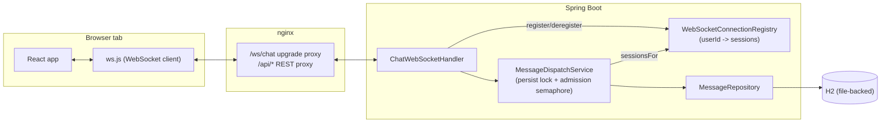
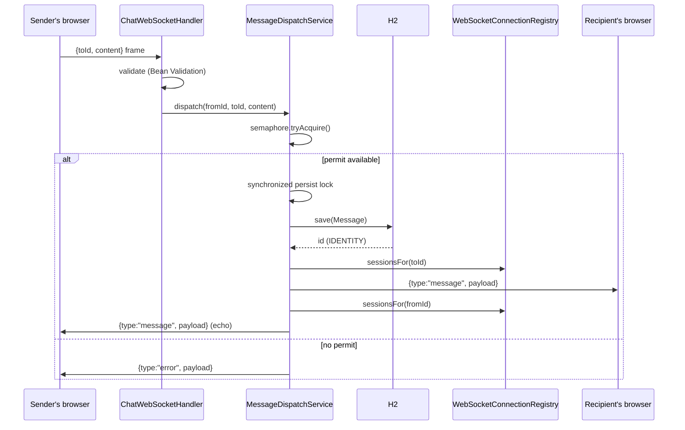

# Notes on this implementation

## Running it

```
docker compose up --build
```

Frontend: http://localhost:8081. Open it in two browser windows (or one normal + one incognito),
log in as two different usernames (no password), pick each other from the contact list, and
message back and forth in real time.

## Architecture



One WebSocket connection per browser tab, opened once at login and kept open for the life of the
session. It carries both directions: the client sends a `{toId, content}` frame to message
someone, the server pushes a `{type, payload}` frame (`WsServerFrame`) — either a message routed
to that user or an echo of their own sent message. REST (`/api/login`, `/api/users`,
`/api/messages/*`) stays separate and handles auth plus history/catch-up reads only.

## What's hand-built vs. what's a library

The assessment's hard constraint is that the core real-time delivery mechanism can't come from a
framework/library that implements it for you. Concretely:

- **Hand-built**: `MessageDispatchService` (persist-then-push, the admission-control semaphore,
  the cross-sender persist lock) and `WebSocketConnectionRegistry` (`Map<userId, connections>` +
  fan-out), in `chat-backend/src/main/java/.../realtime/`. This is the actual "diagram" — an
  accepted message is persisted and pushed to whichever of the sender's and recipient's
  connections are currently live. No STOMP/AMQP/Kafka/Socket.IO — the routing and delivery logic
  is ours.
- **Library, not core**: `WebSocketSession`/`TextWebSocketHandler` are thin primitives for holding
  one connection open and reading/writing frames on it — they have no concept of users or routing,
  so using them isn't "using a messaging framework." `ConcurrentWebSocketSessionDecorator` (also
  Spring Framework, not a messaging layer) only serializes/bounds sends on one already-identified
  connection — it doesn't know which user that connection belongs to or how to fan a message out,
  which is exactly the part `WebSocketConnectionRegistry` supplies. Same reasoning for Spring Data
  JPA (an ORM, not the messaging core) and React (a UI framework, not the messaging core).

## How a message is delivered



- Inbound frames on one connection are handled one at a time by the container, so one sender's
  messages are always processed in the order they were sent.
- The persist step runs under a lock, so two different senders' writes to the DB's
  `IDENTITY`-generated `id` column can never commit out of order — both the conversation history
  and the `/api/messages/after/{id}` catch-up cursor rely on that id being monotonic.
- Every registered `WebSocketSession` is wrapped in `ConcurrentWebSocketSessionDecorator`, so
  concurrent pushes to the same connection (e.g. two people messaging the same recipient at once)
  are serialized per-connection rather than needing a global lock, and a slow client gets bounded
  buffering before its connection is dropped rather than blocking anyone else.
- A bounded semaphore around the persist+push step is the explicit "busy" signal: once saturated,
  the caller gets an error frame immediately instead of the request piling up.

## Connection lifecycle

Handshake: `HttpSessionHandshakeInterceptor` copies the `HttpSession`'s attributes into the
handshake's attribute map, then `WebSocketAuthInterceptor` checks for a `userId` attribute and
rejects the upgrade with 401 if it's missing — the handshake is still a plain HTTP request that
carries the login cookie, so this reuses the same session `AuthController` establishes at
`/api/login`. Once accepted, `ChatWebSocketHandler.afterConnectionEstablished` registers the
session in `WebSocketConnectionRegistry`.

Teardown: `afterConnectionClosed`/`handleTransportError` deregister the session; a failed push (a
dead connection, or `ConcurrentWebSocketSessionDecorator` giving up on a slow client) deregisters
reactively from the same path.

Reconnect: native `WebSocket` doesn't auto-reconnect on drop, so `chat-frontend/src/ws.js` runs its
own retry loop with exponential backoff (500ms → 15s, jittered). Every successful (re)connection
triggers a catch-up fetch (`GET /api/messages/after/{lastSeenId}`), so any gap from a dropped
connection is always closed before the user notices.

## Design decisions and their trade-offs
1. **Message loss window on crash.** A message is durable the instant `save()` commits inside the
   persist lock. The only loss window is the gap between a frame being read off the socket and
   that one synchronous `save()` call committing — narrow (in-process, sub-millisecond) rather than
   a structural gap. Production fix: a durable log (Kafka) or a DB-backed outbox table written
   synchronously in the same transaction, drained by a separate process. Not worth building for
   this assessment's scope.

2. **Ordering and concurrency are each scoped to what actually needs them**, not funneled through
   one shared structure: per-connection inbound ordering comes from the servlet container for
   free, the persist lock only guards one INSERT, and per-connection outbound serialization is
   scoped to one connection at a time (see "How a message is delivered" above). The trade-off of
   *not* having one global sequencing point is that there's no single place to reason about
   cross-conversation ordering — but nothing in this app needs that: catch-up and history are
   scoped per user, and ordering within a conversation only needs the DB id (#4).

3. **Two-part answer to burst load: virtual threads for headroom, a semaphore for an explicit
   reject signal.** `spring.threads.virtual.enabled=true` gives every inbound HTTP request and WS
   frame dispatch its own cheap virtual thread instead of contending for a small platform-thread
   pool — that's headroom, not backpressure, since the bottleneck just moves downstream to
   HikariCP's connection pool (default max 10). A non-blocking `Semaphore`
   (`DISPATCH_PERMITS`, sized ~2-3x the pool size) around the persist+push unit of work in
   `MessageDispatchService.dispatch()` is the actual backpressure: once saturated it sends an
   in-band error frame and refuses the work immediately rather than letting requests pile up with
   no signal. Neither piece adds horizontal/multi-instance scalability (see #6) — that's a
   separate, materially bigger change.

4. **Ordering by DB id, not timestamp.** Both `Message.sentAt` and any client-supplied time are
   subject to clock skew across devices/containers. The `id` column is assigned by the DB and
   protected from concurrent-commit reordering by the persist lock (#2/#3 above), so it's what
   both the history and catch-up (`/api/messages/after`) endpoints sort and cursor on. Have been
   bitten by timestamp-ordered chat history before — two messages sent within the same clock tick
   sort inconsistently, or a container's clock is a few hundred ms off from another's and messages
   appear to arrive "before" a reply they're actually responding to.

5. **No password auth.** Username-only login. Anyone can claim any username — this is a
   deliberate MVP scope cut given the assessment explicitly bars external SaaS/auth providers and
   the time budget, not an oversight. Flagging it explicitly rather than leaving it implicit.

6. **Single-instance only.** The WebSocket connection registry and `HttpSession` are both
   in-process, in-memory. A second backend replica wouldn't see the first one's connections or
   sessions, so this doesn't horizontally scale as-is. Fine given the assessment runs
   locally/single-container; a real deployment behind a load balancer needs either sticky sessions
   plus a shared pub/sub (e.g. Redis) for cross-instance fan-out, or a different transport shape
   entirely.

7. **Why one bidirectional WebSocket connection, not separate channels for send/receive.** Keeping
   both directions of a conversation on one connection is what lets ordering and backpressure be
   scoped per-connection (see above) instead of needing one global structure shared by every
   sender. Trade-offs that come with that choice:
   - nginx needs `Upgrade`/`Connection: upgrade` proxying for `/ws/chat`
     (`chat-frontend/nginx.conf`), and the local dev proxy needs a matching `ws: true` entry
     (`chat-frontend/vite.config.js`).
   - The browser doesn't auto-reconnect a dropped WebSocket, so the client owns retry/backoff (see
     "Connection lifecycle" above).
   - There's no HTTP status-code channel once a frame is in flight over an already-upgraded
     connection, so validation failures and admission-control rejections ride in-band as
     `{type:"error"}` frames (`WsServerFrame`) instead of HTTP error responses.
   - The handshake isn't behind the normal MVC exception pipeline, so it needs its own auth check
     (`WebSocketAuthInterceptor`) rather than relying on `GlobalExceptionHandler`.

8. **No optimistic UI updates.** The frontend doesn't render a message locally when the user hits
   send — it waits for the echo pushed back over the same WebSocket connection (`MessageDispatchService`
   pushes every dispatched message to the sender's own connections too). This avoids an entire
   class of bugs where the locally-rendered copy drifts from what the server actually persisted
   (different id, different content after server-side normalization, etc.). Trade-off: perceived
   latency is exactly real latency, no artificial snappiness.

9. **No message encryption at rest**, and the H2 file DB has no application-level access control
   beyond the container boundary. Out of scope for the assessment (no external KMS/secrets allowed
   anyway).

## Testing

Deliberately weighted toward the hand-built core over CRUD/DTO coverage:

- `MessageDispatchServiceTest` (plain Mockito, no Spring context) proves: a message is persisted
  and delivered to both the recipient and the sender's own connection; persistence still happens
  when the recipient has no live connection (durability over delivery); a dead connection that
  fails to send is pruned from the registry; the persist lock actually excludes concurrent
  callers (two threads racing `dispatch()` never enter the guarded `save()` call at the same
  time); and the admission-control semaphore rejects with an error frame, without persisting, once
  its permits are exhausted.
- `WebSocketConnectionRegistryTest` proves every registered session is wrapped in
  `ConcurrentWebSocketSessionDecorator` — it does not re-test the decorator's own send
  serialization, which is Spring Framework's own tested behavior.
- `RealtimeChatIntegrationTest` is the one real end-to-end test: two real WebSocket clients (via
  the JDK's `HttpClient.newWebSocketBuilder()`) against a running server, reproducing the
  assessment's actual acceptance test ("two different browser windows messaging each other").

Full tactical DDD (aggregates, value objects) was skipped as unwarranted ceremony for two entities
and one core service; tests are where the edge-case awareness this assessment scores for is meant
to show up as proof, not just as comments.

One behavior has no automated coverage, called out explicitly rather than left silent: the
frontend's reconnect-with-backoff loop (`chat-frontend/src/ws.js`) after a dropped connection is a
client-side timing/network behavior, verified manually (kill a tab's connection, confirm it
reconnects and fetches the catch-up gap) rather than in the test suite.
